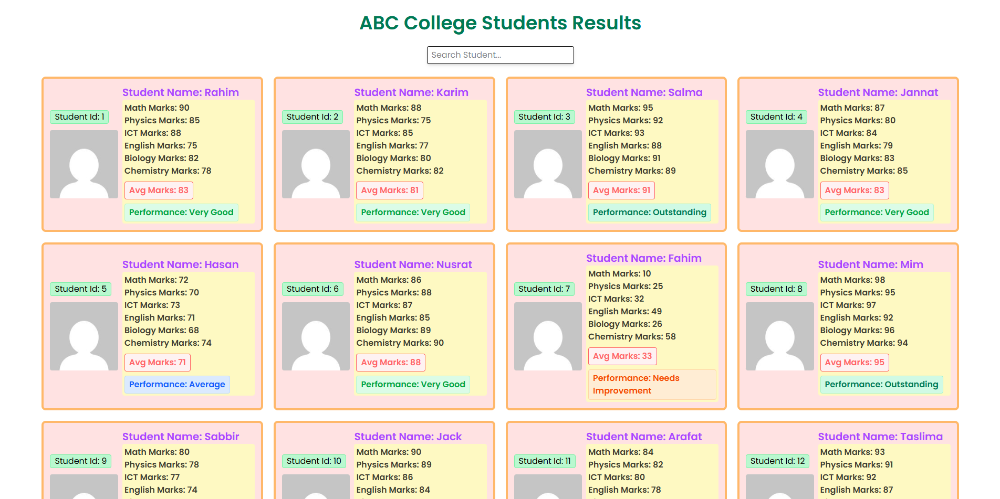
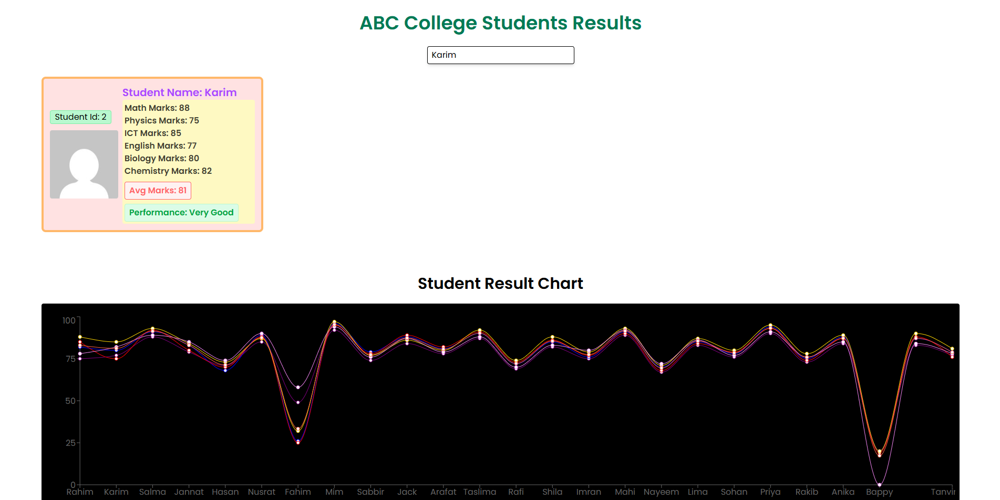
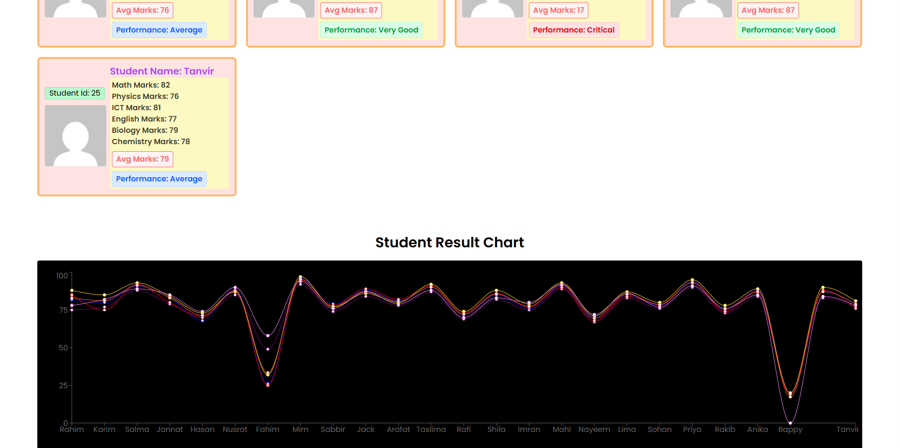

# 🎓 Students Results Dashboard

A modern, responsive, and interactive **React** application designed to visualize and manage student academic performance. This project features real-time search, performance analytics, and dynamic data visualization using Recharts.

## 🚀 Live Demo
Check out the live project here: [https://student-result-dashboard.netlify.app/](https://student-result-dashboard.netlify.app/)

## ✨ Key Features

* 🔍 **Real-time Search:** Instantly filter students by name with case-insensitive and whitespace-friendly search.
* 📊 **Data Visualization:** Interactive line charts showing student performance across multiple subjects (Math, Physics, ICT, etc.).
* ⚡ **Performance Metrics:** Automatically calculates average marks and assigns performance labels (e.g., Outstanding, Very Good, Average).
* 📱 **Fully Responsive:** Optimized for all screen sizes using **Tailwind CSS**.
* 🎨 **Modern UI:** Clean card-based layout with a dark-themed analytics section.

## 🛠️ Technologies Used

* **React.js** (Frontend Library)
* **Vite** (Build Tool)
* **Tailwind CSS** (Styling)
* **Recharts** (Data Visualization)

## 📦 Installation & Setup

If you want to run this project locally, follow these steps:

1.  **Clone the repository:**
    ```bash
    git clone [https://github.com/your-username/student-result-dashboard.git](https://github.com/your-username/student-result-dashboard.git)
    ```
2.  **Navigate to the project directory:**
    ```bash
    cd student-result-dashboard
    ```
3.  **Install dependencies:**
    ```bash
    npm install
    ```
4.  **Start the development server:**
    ```bash
    npm run dev
    ```

## 📸 Screenshots

| Dashboard Overview | Search Functionality | Analytics Chart |
| :--- | :--- | :--- |
|  |  |  |

---

Developed with ❤️ by **Salman Sahed**